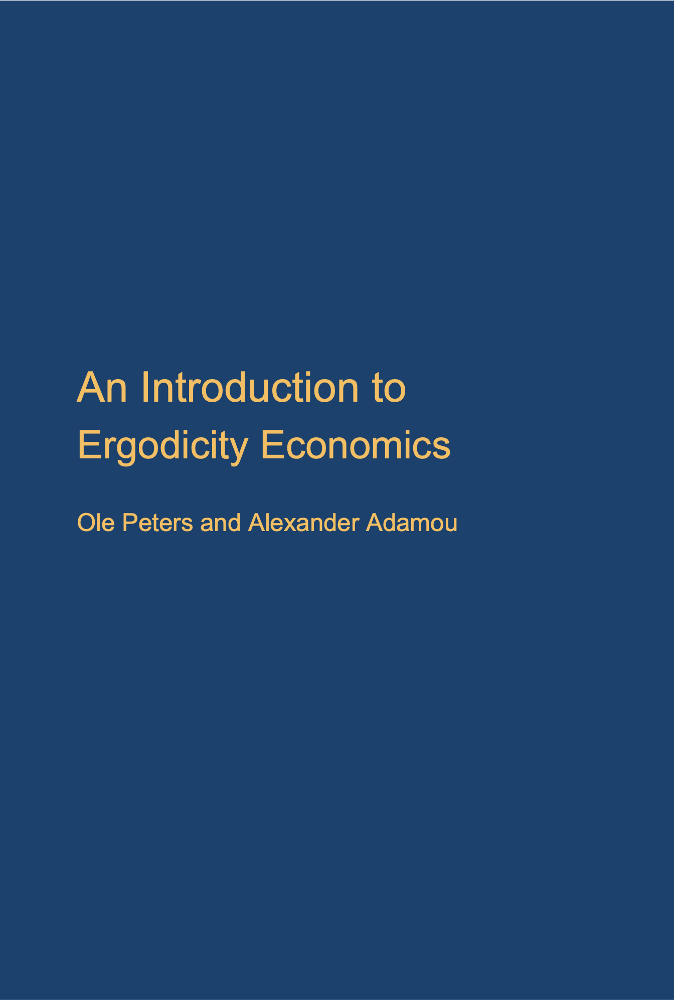

Templates for presentations based on Peters and Adamou, *An Introduction to Ergodicity Economics,* LML Press, 2025.

<p align="center">
  
</p>

---

## Setup

Create and activate the conda environment (one-time):

```bash
conda env create -f environment.yml
conda activate ee_presentations
```

---

## Workflow

### 1 — Write slides in LaTeX

Edit the `.tex` file, then compile to PDF:

```bash
./build.sh
```

This runs `pdflatex` twice (required for Beamer cross-references) and removes all auxiliary files, leaving only the `.pdf`.

---

### 2 — Run the browser presentation

```bash
conda activate ee_presentations
streamlit run presentation.py
```

The presentation opens automatically at `http://localhost:8501`.

**Navigation:** use the **← →** (or **↑ ↓**) arrow keys to move between slides.  
The slide fills the full browser window; zoom the browser to taste.

---

### 3 — Add interactive Streamlit slides

Slides are a mix of PDF pages and live Streamlit apps. To add a new interactive slide:

**Step 1** — write a function in `presentation.py`:

```python
def my_slide() -> None:
    st.subheader("My interactive slide")
    x = st.slider("x", 0.0, 10.0, 5.0)
    st.write(f"x² = {x**2:.2f}")
```

**Step 2** — register it in `APP_SLIDES`:

```python
APP_SLIDES: dict = {
    "demo": app_slide_demo,
    "mine": my_slide,       # ← add this
}
```

**Step 3** — place it in the deck by editing `build_slides()`:

```python
slides.append(("pdf", 3))        # PDF page 4 (0-based)
slides.append(("app", "mine"))   # your interactive slide
slides.append(("pdf", 4))        # PDF page 5
```

Each entry is either `("pdf", page_index)` (0-based) or `("app", key)`.

---

## File overview

| File | Purpose |
|---|---|
| `*.tex` | LaTeX / Beamer source |
| `build.sh` | Compile LaTeX → PDF and clean up |
| `presentation.py` | Streamlit presentation viewer |
| `environment.yml` | Conda environment definition |
| `figs/` | Figures used in the LaTeX source |
